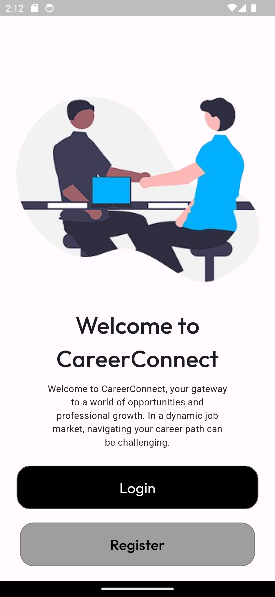
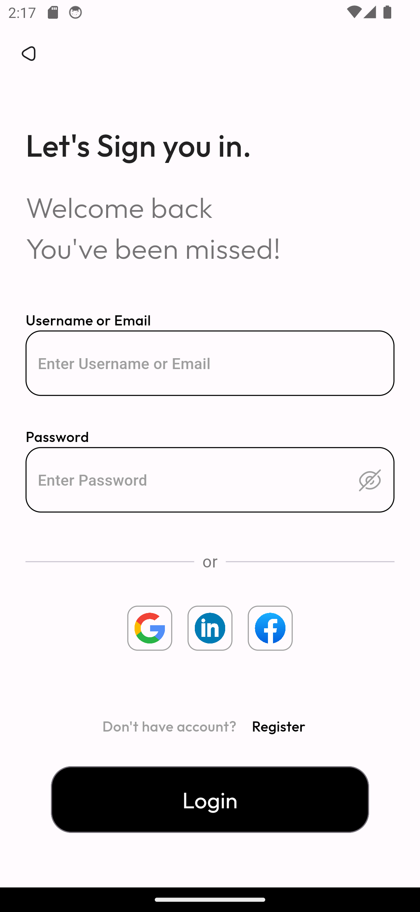
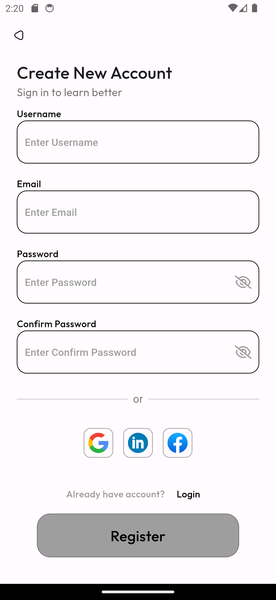

# CareerConnect Flutter Project

Welcome to CareerConnect, a Flutter project that focuses on creating the user interface for a job portal application. In this stage, we have designed the login and signup pages to provide users with a glimpse of the app's look and feel.

## Table of Contents

- [Screenshots](#screenshots)
- [Getting Started](#getting-started)

## Screenshots









## Getting Started

To get started with CareerConnect, follow these steps:

1. **Clone the Repository:**
   ```bash
   git clone https://github.com/yashCodesDev/job_login_ui.git
